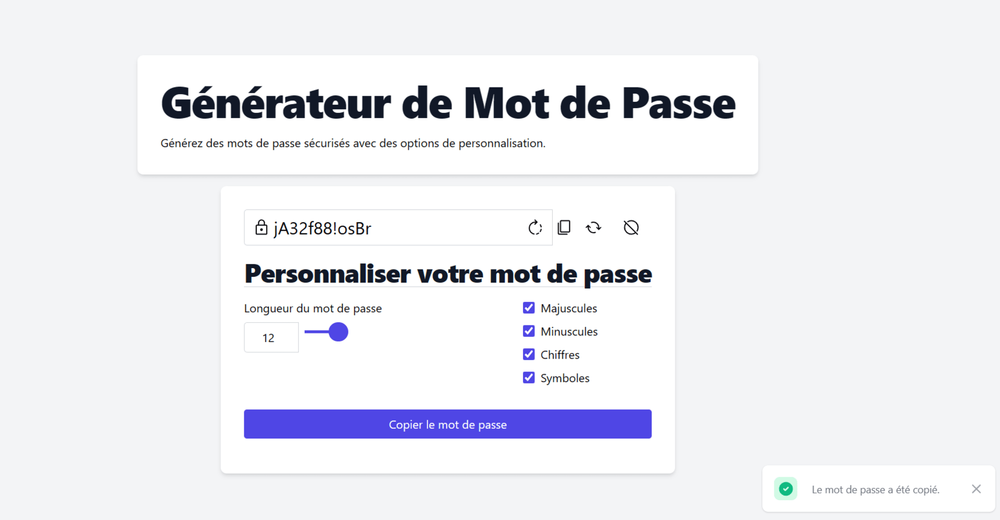

# PasswordGenerator

## Présentation

Le PasswordGenerator est une application simple développée pour créer des mots de passe sécurisés en fonction de diverses options. Cette application a été conçue pour aider les utilisateurs à générer des mots de passe forts et personnalisés pour leurs besoins en sécurité en ligne.

## Prévisualisation



## Installation

1. Téléchargez ou clonez le repository du projet à partir de GitHub.
2. Accédez au dossier du projet.
```shell
cd PasswordGenerator
```

## Utilisation

1. Ouvrez le fichier `index.html` dans votre navigateur.
2. Utilisez les options fournies pour personnaliser les critères de génération de mot de passe.
3. Cliquez sur le bouton "Générer Mot de Passe" pour obtenir un mot de passe sécurisé basé sur les options sélectionnées.
Vous pouvez également copier le mot de passe dans votre presse-papiers en cliquant sur le bouton "Copier".

## Technologies utilisées

- HTML : Utilisé pour la structure de base de la page.
- CSS (Tailwind CSS) : Utilisé pour la mise en page et le style de l'interface utilisateur.
- JavaScript : Utilisé pour la logique de génération de mot de passe et la gestion des événements.
- SVG : Utilisé pour les icônes affichées dans l'interface utilisateur en utilisant https://fonts.google.com/.

## Licence
Ce projet est publié sous la licence MIT. Pour plus d'informations, consultez le fichier LICENSE.

[](https://choosealicense.com/licenses/mit/)

# Crédits
Les icônes : https://fonts.google.com/
